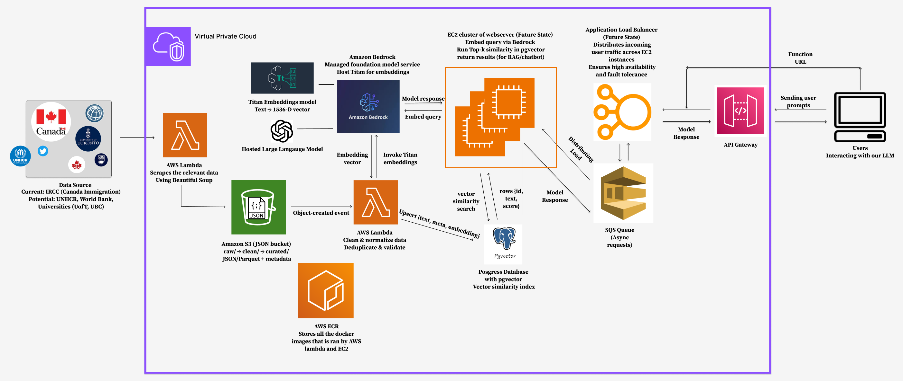

<div align="center">

# 🍁 Immigreat

### AI-Powered Canadian Immigration Assistant

[](https://github.com/UofT-CSC490-F2025/Immigreat/actions/workflows/test-coverage.yml)


**Production-grade Retrieval-Augmented Generation (RAG) system for Canadian immigration guidance**

[🌐 Visit Immigreat Website](https://frontend-deployment.d1bzdr05ipy0gp.amplifyapp.com/)

[Features](#-features) • [Architecture](#-architecture) • [Getting Started](#-getting-started) • [Documentation](#-documentation)

</div>

---

## 📖 Overview

**Immigreat** is a RAG-powered LLM assistant that helps users navigate the complexities of Canadian immigration. It combines semantic search with large language models to provide accurate, source-based answers to immigration questions.

### Key Highlights

- 🎯 **95.06% test coverage** with comprehensive failure mode testing
- ⚡ **Low query latency** with stage-level performance metrics
- 🔍 **FE-RAG (Facet-Expanded RAG)** - Modern retrieval enhancement increasing source diversity.
- 🥉: **Reranking** - Rerank retrieved chunks based on relevancy
- 🕵️: **RL Judge Filtering** - Improved answer accuracy using RL Judge Filtering
- 🏗️ **Serverless architecture** on AWS with automatic scaling
- 🔒 **Production-grade resilience** - Exponential backoff, graceful degradation, ACID guarantees

---

## ✨ Features

### Core Capabilities

- **Intelligent Q&A** - Ask questions about Canadian immigration in natural language
- **Multi-Turn Conversations** - Context-aware follow-up questions with session persistence
- **Real-Time Search Parameters** - Configurable retrieval parameters (k, faceted search, re-ranking)
- **Answer Filtering** - RL Judge for assured answer faithfulness
  
### Technical Features

- **Semantic Search** - 1,536-dimensional embeddings via AWS Bedrock Titan
- **Advanced Retrieval** - Optional Cohere re-ranking for improved relevance
- **Multi-Source Ingestion** - Automated scrapers for IRCC, IRPA/IRPR, Refugee Law Lab, and official forms
- **Vector Database** - PostgreSQL with pgvector extension for efficient similarity search
- **Conversation History** - Session ID based history retrieval

---

## 🏗️ Architecture

### System Overview

<div align="center">
  
  <p><em>End-to-end architecture showing data flow from frontend through RAG pipeline to AWS services</em></p>
</div>

### Tech Stack

**Backend:**

- Python 3.13
- AWS Lambda (ARM64 Graviton2)
- PostgreSQL 16.8 + pgvector
- AWS Bedrock (Titan, Claude 3.5 Sonnet, Cohere)
- Terraform (Infrastructure as Code)

**Frontend:**

- React 19.2 + TypeScript
- Vite 7.2 (build tool)
- Tailwind CSS 3.4
- AWS Amplify (hosting)

**Data Pipeline:**

- Beautiful Soup + Playwright (web scraping)
- S3 (tiered storage: raw/cleaned/curated)
- Lambda triggers for automated processing

---

## 🚀 Getting Started

### Prerequisites

- Python 3.13+
- Node.js 18+ (for frontend development)
- AWS Account (for deployment)
- Terraform 1.5+
- Docker (for Lambda container builds)

### Local Development

#### Backend Setup

```bash
# Clone the repository
git clone https://github.com/UofT-CSC490-F2025/Immigreat.git
cd Immigreat

# Create virtual environment
python -m venv venv
source venv/bin/activate  # Windows: venv\Scripts\Activate.ps1

# Install dependencies
pip install -r requirements-dev.txt

# Run tests
pytest --cov=src --cov-report=html --cov-report=term

# View coverage report
open htmlcov/index.html  # Windows: start htmlcov/index.html
```

#### Frontend Setup

```bash
cd frontend/immigreat

# Install dependencies
npm install

# Start development server
npm run dev

# Build for production
npm run build
```

### Deployment

For this section, we have been using either Linux / Unix, or running these commands in wsl (Windows Subsystem for Linux) if we are on a Windows

#### Infrastructure Provisioning

```bash
cd infra

# (Optional) If unable to run the lambda as is:
dos2unix scripts/build_lambda.sh

# Build lambda
./scripts/build_lambda.sh

# Initialize Terraform
terraform init

# Plan deployment (dev environment)
terraform plan -var-file=enviroments/dev.tfvars

# Apply infrastructure
terraform apply -var-file=enviroments/dev.tfvars

# Deploy Lambda functions
./scripts/deploy_dev.sh
```

#### Frontend Deployment

Frontend automatically deploys via **AWS Amplify** when pushing to `main` branch. Configure in AWS Console:

1. Connect GitHub repository
2. Set build settings to use `amplify.yml`
3. Add environment variable: `VITE_API_URL=<Lambda Function URL>`

---

## 📊 Project Structure

```  
Immigreat/
├── frontend/                   # React frontend application
│   └── immigreat/
│       ├── src/
│       │   ├── App.tsx        # Main chat interface
│       │   ├── services/      # API client
│       │   └── assets/        # Images, icons
│       ├── package.json
│       └── vite.config.ts
│
├── infra/                      # Terraform infrastructure
│   ├── main.tf                # Core infrastructure
│   ├── lambda.tf              # Lambda functions
│   ├── pgvector.tf            # RDS PostgreSQL
│   ├── s3.tf                  # Storage buckets
│   ├── enviroments/           # Environment configs
│   └── scripts/               # Deployment scripts
│
├── src/                        # Backend Python code
│   ├── data_ingestion.py      # Document processing pipeline
│   ├── model/
│   │   ├── rag_pipeline.py    # RAG query processing
│   │   └── db_admin_lambda.py # Database utilities
│   ├── scraping/              # Web scrapers
│   │   ├── ircc_scraper.py
│   │   ├── forms_scraper.py
│   │   └── refugee_law_lab_scraper.py
│   ├── Dockerfile             # Lambda container image
│   └── requirements.txt
│
├── tests/                      # Comprehensive test suite
│   ├── unit/                  # Unit tests (95.06% coverage)
│   ├── integration/           # Integration tests
│   └── conftest.py            # Shared fixtures
│
├── rag_llm_judge/             # RLVR judge training
│   ├── judge/                 # Judge model implementation
│   ├── baseline/              # Baseline classifiers
│   └── outputs/               # Training results
│
├── load_test/                 # Locust performance tests
├── scripts/                   # Utility scripts
├── amplify.yml                # AWS Amplify build config
└── README.md                  # This file
```

---

## 🧪 Testing

### Running Tests

```bash
# Quick test run
python run_tests.py

# With HTML coverage report
python run_tests.py --html

# Unit tests only (fast)
python run_tests.py --unit --fast

# Windows PowerShell
.\run_tests.ps1 -Html
```

### Test Coverage

We maintain **>90% code coverage** across all modules:

| Module            | Coverage   | Lines         | Branches |
| ----------------- | ---------- | ------------- | -------- |
| data_ingestion.py | 100%       | 274/274       | 94%      |
| rag_pipeline.py   | 94%        | 182/194       | 78%      |
| scrapers          | 97%        | 743/767       | 94%      |
| **Overall**       | **95.06%** | **1237/1273** | **92%**  |

### Test Structure

- `tests/unit/` - Unit tests for individual functions/classes
- `tests/integration/` - End-to-end integration tests
- `tests/conftest.py` - Shared fixtures (mocks, test data)

---

## 📚 Documentation

### Core Documentation

- 📖 [TESTING.md](TESTING.md) - Comprehensive testing guide
- 🚀 [QUICKSTART_TESTING.md](QUICKSTART_TESTING.md) - Quick testing reference
- 📊 [TEST_COVERAGE_SUMMARY.md](TEST_COVERAGE_SUMMARY.md) - Coverage implementation details
- 📝 [IMPLEMENTATION_CHECKLIST.md](IMPLEMENTATION_CHECKLIST.md) - Project milestones
- 📄 [technical_approach.tex](technical_approach.tex) - Academic paper on system design

### Additional Resources

- [AWS Bedrock Documentation](https://docs.aws.amazon.com/bedrock/)
- [pgvector GitHub](https://github.com/pgvector/pgvector)
- [Terraform AWS Provider](https://registry.terraform.io/providers/hashicorp/aws/latest/docs)

---

## 🔬 Research Components

### FE-RAG (Facet-Expanded RAG) with Rerank 

Modern metadata-driven retrieval enhancement that increases result diversity by without sacrificing relevance. Exploits document metadata (source, title, section) as lightweight graph edges for coverage expansion. Uses Rerank 

### RLVR Judge Training

Reinforcement Learning with Verifiable Rewards system for training a judge model (Qwen 2.5-1.5B) to evaluate factual correctness of immigration answers. Located in `rag_llm_judge/`.

### Performance Optimization

- Exponential backoff with jitter for API throttling
- IVFFlat indexing for O(√n) vector search complexity
- Stage-level performance telemetry
- Lambda ARM64 Graviton2 for cost efficiency

---

## 🚦 Performance Metrics

### RL Judge Performance evaluation over different k values, with and without rerank and facet expansion


### Latency Breakdown (Typical Query)

| Stage            | Time (ms) | % of Total |
| ---------------- | --------- | ---------- |
| Embedding        | 245       | 9%         |
| Retrieval        | 87        | 3%         |
| FE-RAG Expansion | 112       | 4%         |
| Re-ranking       | 524       | 19%        |
| LLM Generation   | 1834      | 65%        |
| **Total**        | **2802**  | **100%**   |

### Cost Analysis (per query)

- Lambda compute: $0.00047
- Titan embedding: $0.00003
- Claude generation: $0.00825
- Cohere rerank (optional): $0.024
- **Total baseline**: $0.00875/query

---

## 🤝 Contributing

This is a University of Toronto CSC490 capstone project. For contributions:

1. Fork the repository
2. Create a feature branch (`git checkout -b feature/amazing-feature`)
3. Commit your changes (`git commit -m 'Add amazing feature'`)
4. Push to the branch (`git push origin feature/amazing-feature`)
5. Open a Pull Request

### Code Quality Standards

- Maintain >90% test coverage
- Follow PEP 8 style guide (Python)
- Use ESLint + Prettier (TypeScript/React)
- Add type hints to all Python functions
- Document complex logic with inline comments

---

## 📄 License

This project is licensed under the MIT License - see the [LICENSE](LICENSE) file for details.

---

## 👥 Team

**Immigreat Development Team**

Department of Computer Science  
University of Toronto

---

## 🙏 Acknowledgments

- University of Toronto Computer Science Department
- CSC490 Course Instructors
- AWS for Bedrock API access
- Open-source communities (pgvector, Terraform, React)

---

## 📮 Contact & Support

- **GitHub Issues**: [Report bugs or request features](https://github.com/UofT-CSC490-F2025/Immigreat/issues)

</div>


